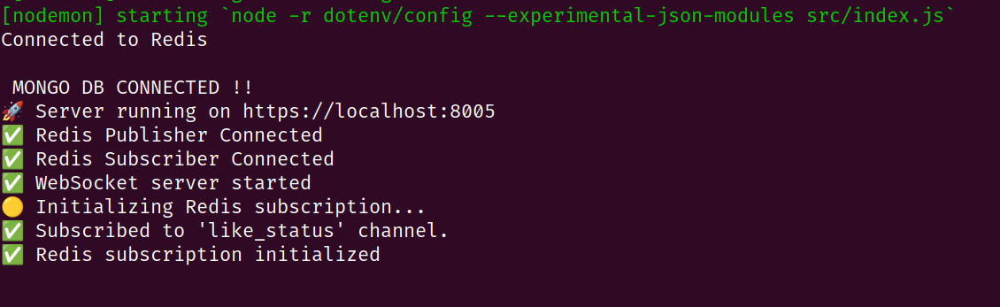

# \*_CampusX - Backend 🚀 _(Building in Progress)\*

**CampusX** is a dynamic and interactive platform designed exclusively for the **CMRIT community**. Whether you're a **student, faculty member, or part of a campus organization**, CampusX brings everyone together to **share updates, discuss topics, and stay informed** about everything happening on campus.

# Project Structure:

```
.
├── cert.pem
├── DB_MODEl.png
├── dump.rdb
├── image-1.png
├── key.pem
├── package.json
├── package-lock.json
├── public
│   ├── temp
│   └── uploads
│       ├── 20220817_130813.jpg
│       └── college-svgrepo-com.svg
├── README.md
└── src
    ├── app.js
    ├── config
    │   ├── redis.js
    │   └── server.js
    ├── constants
    │   └── statusCodes.js
    ├── constants.js
    ├── controllers
    │   ├── auth.controller.js
    │   ├── bookmark.controller.js
    │   ├── comment.controller.js
    │   ├── like.controller.js
    │   ├── post.controller.js
    │   └── user.controller.js
    ├── db
    │   └── db.js
    ├── index.js
    ├── middlewares
    │   ├── auth.middleware.js
    │   ├── error.middleware.js
    │   └── multer.middleware.js
    ├── models
    │   ├── bookmark.model.js
    │   ├── comment.model.js
    │   ├── notification.model.js
    │   ├── post.model.js
    │   ├── report.model.js
    │   ├── subscription.model.js
    │   └── user.models.js
    ├── redis_pub_sub
    │   ├── publishers
    │   │   └── likePubliser.js
    │   └── subscribers
    │       └── likeSubscriber.js
    ├── routes
    │   ├── auth.routes.js
    │   ├── bookmark.routes.js
    │   ├── like.routes.js
    │   ├── post.routes.js
    │   └── user.routes.js
    ├── utils
    │   ├── ApiError.js
    │   ├── ApiResponse.js
    │   ├── AsyncHandler.js
    │   ├── cloudnary.js
    │   ├── redisClient.js
    │   └── sendOtp.js
    └── webSocket
        └── webSocket.js

```

## **🚀 Tech Stack**

- **Node.js** - Runtime environment
- **Express.js** - Web framework
- **MongoDB + Mongoose** - Database & ODM
- **JWT Authentication** - Secure login system
- **Cloudinary** - Image storage
- **Multer** - File handling middleware
- **Redis** - Caching, rate limiting, and session management,improving performance
- **WebSockets (Socket.io)** - Real-time notifier for about the state of the request

# 🚀 **Optimizing CampusX Performance with Redis**

CampusX leverages **Redis** to improve app performance by caching frequently accessed data and using queues for background tasks. WebSockets are used to notify the frontend in real time.

- **User Profiles:** When a user profile is requested, it is first checked in Redis. If found, it is returned instantly; otherwise, it is fetched from the database and stored in Redis for future requests.
- **Recent Posts & Comments:** Instead of querying the database every time, recent posts and comments are cached in Redis for quick retrieval, reducing query times.

This approach significantly improves API response times and enhances user experience.

---

## 🚫 **Rate Limiting with Redis** to prevent spam in posts(yet to be done)

## **📡 Real-Time Updates Using WebSockets**

WebSockets are used to send real-time updates to the frontend for various actions. In CampusX, WebSockets notify users about:

Important events like comments, likes, are delivered in real time using WebSockets.

This ensures users stay updated without needing to refresh the page.

---

## **🛠️ API Endpoints** _(Tested via Postman)_

### **Base URL:** `http://localhost:$port`

### 🔑 **OTP Authentication**

#### **POST /auth/send-otp** - Send OTP to user

| Key   | Type   | Description  |
| ----- | ------ | ------------ |
| email | String | User's email |

#### **POST /auth/verify-otp** - Verify OTP

| Key   | Type   | Description            |
| ----- | ------ | ---------------------- |
| email | String | User's email           |
| otp   | String | OTP received via email |

---

## **📝 User Routes**

### **POST /users/register** - Register a new user

| Key        | Type   | Description                                                       |
| ---------- | ------ | ----------------------------------------------------------------- |
| fullName   | String | Full name of the user                                             |
| email      | String | Email address                                                     |
| userName   | String | Username                                                          |
| password   | String | Password                                                          |
| role       | String | `Student`, `Faculty`, `Cell` (enum)                               |
| year       | String | `First-Year`, `Second-Year`, `PreFinal-Year`, `Final-Year` (enum) |
| department | String | `CSE`, `ISE`, `EEE`, `ECE`, `MBA`, `AIML`, `AIDS`, `CIVIL` (enum) |
| avatar     | File   | Profile picture                                                   |
| coverImage | File   | Cover image _(Optional)_                                          |

#### **POST /users/login** - Login

| Key      | Type   | Description      |
| -------- | ------ | ---------------- |
| email    | String | Registered email |
| password | String | User password    |

#### **GET /users/channel/:user** - Get a user's channel profile

#### **Secure Routes (JWT Required)** 🔒

- **POST /users/logout** - Logout
- **POST /users/refresh-token** - Refresh access token

- **POST /users/change-password** - Change password
  | Key | Type | Description |
  | -------- | ------ | ---------------- |
  | oldPassword | String | old password |
  | newPassword | String | new password |
  | confPassword | String | confirm new password |

- **GET /users/current-user** - Get logged-in user details
- **PATCH /users/update-account** - Update account details
  | Key | Type | Description |
  | -------- | ------ | ---------------- |
  | email | String | new email |
  | fullName | String | new full name |

- **PATCH /users/update-avatar** - Update profile picture
  | Key | Type | Description |
  | -------- | ------ | ---------------- |
  | avatar | File | Selected image |

- **PATCH /users/update-coverimage** - Update cover image
  | Key | Type | Description |
  | -------- | ------ | ---------------- |
  | coverImage | File | Selected image |

- **GET /users/get-bookmarks** - Get bookmarked posts
- **POST /users/:userId/follow** - Follow a user
- **POST /users/:userId/unfollow** - Unfollow a user
- **DELETE /users/delete-account** - Delete account

---

## **📝 Post Routes**

### **POST /posts/** - Create a post

| Key      | Type   | Description                                                                  |
| -------- | ------ | ---------------------------------------------------------------------------- |
| content  | String | Post content                                                                 |
| category | String | `general`, `exams`, `placements`, `competitions`, `hackathons`, `lost_found` |
| image    | File   | _(Optional)_ Image                                                           |

#### **Other Post Routes:**

- **GET /posts/** - Get all posts
- **GET /posts/:id** - Get a specific post
- **DELETE /posts/:id** - Delete a post

---

## **💬 Comments**

- **POST /posts/:postId/comments** - Add a comment
- **GET /posts/:postId/comments** - Get all comments
- **DELETE /posts/:postId/comments/:commentId** - Delete a comment

---

## **🔖 Bookmark Routes**

- **POST /bookmarks/:postId** - Bookmark a post
- **DELETE /bookmarks/:bookmarkId** - Remove bookmark
- **GET /bookmarks/** - Get all bookmarks

---

## **❤️ Like Routes**

- **POST /likes/:postId/like** - Like/unlike a post _(Toggle)_

---

### 🗄️ Database Models and Relationships

📌 Overview of Database Models in CampusX
CampusX has 5 main database models, each serving a specific function:

1️⃣ User Model – Stores user details, authentication data, and profile info.

2️⃣ Post Model – Manages posts made by users, including text, images, and categories.

3️⃣ Comment Model – Handles comments on posts with user references.

4️⃣ Subscription Model – Tracks which users follow which topics or other users.

5️⃣ Bookmark Model – Allows users to save posts for later reference.


## **⚙️ Installation & Setup**

### **1️⃣ Clone the Repository**

clone using SSH (Recommended for Frequent Use)

```sh
git clone git@github.com:prathvihan108/campusX.git
```

```sh
cd backend
```

### **2️⃣ Install Dependencies**

```sh
npm install
```

# Installing Redis on Linux

## Other OS's visit the Docs

[Redis installation and set up](https://redis.io/docs/latest/operate/oss_and_stack/install/install-redis/)

## Step 1: fire the follwing commands one by one

```
sudo apt-get install lsb-release curl gpg
curl -fsSL https://packages.redis.io/gpg | sudo gpg --dearmor -o /usr/share/keyrings/redis-archive-keyring.gpg
sudo chmod 644 /usr/share/keyrings/redis-archive-keyring.gpg
echo "deb [signed-by=/usr/share/keyrings/redis-archive-keyring.gpg] https://packages.redis.io/deb $(lsb_release -cs) main" | sudo tee /etc/apt/sources.list.d/redis.list
sudo apt-get update
sudo apt-get install redis
```

Redis will start automatically, and it should restart at boot time. If Redis doesn't start across reboots, you may need to manually enable it:

```
sudo systemctl enable redis-server
sudo systemctl start redis-server
```

After restart of the laptop:if the redis not getting connected then run the following once

```
redis-server &
```

# Generating Self-Signed SSL Certificates (key.pem & cert.pem) on Linux distributons.(Optional Step :Do it if u wnat to test using https ) [know-more-SSL/TLS](https://dev.to/prathvihan108/understanding-ssltls-encryption-how-session-keys-secure-your-communication-2n35)

For Windows/MAC, please ask my advanced NLP model here for identicle commannds: [catgpt777](https://catgpt3.netlify.app/)

## Step 1: Install OpenSSL

```sh
sudo apt update && sudo apt install openssl -y
```

---

## Step 2: Generate SSL Certificates in Backend Directory

1. Navigate to the backend directory:
   ```sh
   cd /path/to/backend
   ```
2. Generate the private key (`key.pem`):
   ```sh
   openssl genpkey -algorithm RSA -out key.pem -aes256
   ```
   - This will prompt for a passphrase (optional, but recommended for security).
3. Generate the self-signed certificate (`cert.pem`):
   ```sh
   openssl req -new -x509 -key key.pem -out cert.pem -days 365
   ```
   - It will ask for details like country, state, organization, and common name (use `localhost` for local dev).
4. Verify the certificate:
   ```sh
   openssl x509 -in cert.pem -noout -text
   ```

---

## Step 3: Generate SSL Certificates in Frontend Directory(No need if u are using PostMan)

1. Navigate to the frontend directory:
   ```sh
   cd /path/to/frontend
   ```
2. Generate the private key (`key.pem`):
   ```sh
   openssl genpkey -algorithm RSA -out key.pem -aes256
   ```
3. Generate the self-signed certificate (`cert.pem`):

   ```sh
   openssl req -new -x509 -key key.pem -out cert.pem -days 365
   ```

### **3️⃣ Configure Environment Variables**

Create a `.env` file and add:

```env
# Email Configuration (Brevo SMTP)
EMAIL=your_email@smtp-brevo.com                  # Brevo (Sendinblue) email ID
EMAIL_PASSWORD=your_email_password               # Brevo email SMTP password
EMAIL_HOST=smtp-relay.brevo.com                  # Brevo SMTP host
EMAIL_PORT=587                                   # Brevo SMTP port (587 for TLS)

# Server Configuration
PORT=8005                                        # Port where the backend server runs
HOST_URL=https://localhost                       # Base URL of the server

# Database Configuration (MongoDB - Using Mongo Atlas)
MONGO_URI=mongodb+srv://<username>:<password>@cluster0.mongodb.net(your url)

DB_NAME=YourDBName

# CORS Configuration
CORS_ORIGIN=https://localhost:5173               # Allowed frontend(do not use "*" else the  cookies will not be attached while sending request on https protocol)

# Authentication Tokens
ACCESS_TOKEN_SECRET= Secret_key         #can be anything
ACCESS_TOKEN_EXPIRY=1d
REFRESH_TOKEN_SECRET=Secret_key            #can be anuthing
REFRESH_TOKEN_EXPIRY=6d

# Environment
NODE_ENV=development                             # Environment mode

# Cloudinary Configuration
CLOUDNARY_APIKEY=your_cloudinary_api_key
CLOUDNARY_SECRET=your_cloudinary_api_secret
CLOUDNARY_CLOUD_NAME=your_cloudinary_cloud_name

# Redis Configuration
REDIS_HOST=127.0.0.1                             # Redis server host
REDIS_PORT=6379                                  # Redis server port

```

### **4️⃣ Start the Server**(/backend)

```sh
npm run dev

```

You are good to test the backend api using postman, if u get the following


# Postman API Collection

Download the Postman collection from the link below:

[Postman Collection Export](https://drive.google.com/file/d/1aJxDLiLk8RuWxiAAM1jNJuIYuv7EesL-/view?usp=sharing)

Navigate to postman and import the json file in your post man

## API Testing Instructions for Postman

### 1. Secure Routes Require Login

- Before accessing secure routes, you must log in.
- Use the login API and obtain the authentication token.

### 2. Image Uploads

- Postman expects image files to be inside the project directory.
- Place images in the following path:
  ```
  backend/public/uploads/your-image.png
  ```
- When selecting the image in Postman, navigate to `uploads` and choose the file.

### 3. Uploading `.md` Files

- Always use `multipart/form-data` format.
- In Postman:
  1. Go to the **Body** tab.
  2. Select `form-data` (top left option).

Ensure these steps are followed for smooth API testing.

## For More Info on how campusX backend works visit the following

[Understanding REST APIs and Best Practices (With CampusX Implementation)](https://dev.to/prathvihan108/understanding-rest-apis-and-best-practices-with-campusx-implementation-64c)

[Multer for file uploads in campusX](https://dev.to/prathvihan108/efficient-file-uploads-in-campusx-with-multer-4p90)

[Cloudnary for image optimisation in campusX](https://dev.to/prathvihan108/optimizing-image-management-in-campusx-with-cloudinary-2ln6)

[MongoDB + Mongoose ODM in campusX](https://dev.to/prathvihan108/mastering-mongodb-with-mongoose-how-campusx-optimizes-data-queries-1jdi)

[OTP varification using Brevo SMPT](https://dev.to/prathvihan108/otp-verification-in-campusx-using-brevo-smtp-3e0e)

[Secure Auth in campusx using JWT](https://dev.to/prathvihan108/secure-authentication-in-campusx-using-jwt-2jem)

[Boosting campusX performance with redis ](https://dev.to/prathvihan108/boosting-performance-with-redis-caching-in-campusx-2goi)

[Redis pub/sub model for real time notifications in campusX](https://dev.to/prathvihan108/real-time-like-notifications-with-redis-pubsub-in-campusx-3082)

[Socket.io and Web Sockets in campusX](https://dev.to/prathvihan108/understanding-websockets-and-the-socketio-library-2pca)

## **Future Plans**(up coming)

### Personalized Recommendations

Get ML-Based post recommendations tailored to your interests.

## **📌 Contributors**

- [**Prathviraj Hanimanale**](https://github.com/prathvihan108)

Contributions related to code optimization, potential bug fixes, and improvements are accepted. However, feature requests are not considered at this time.
If you're making a contribution, please create a pull request with a suitable branch name that reflects the changes being made. 🚀

## License

This project is licensed under the CC BY-NC 4.0 License - see the [LICENSE](../LICENSE) file for details.

Full License Details: [https://creativecommons.org/licenses/by-nc/4.0/](https://creativecommons.org/licenses/by-nc/4.0/)
