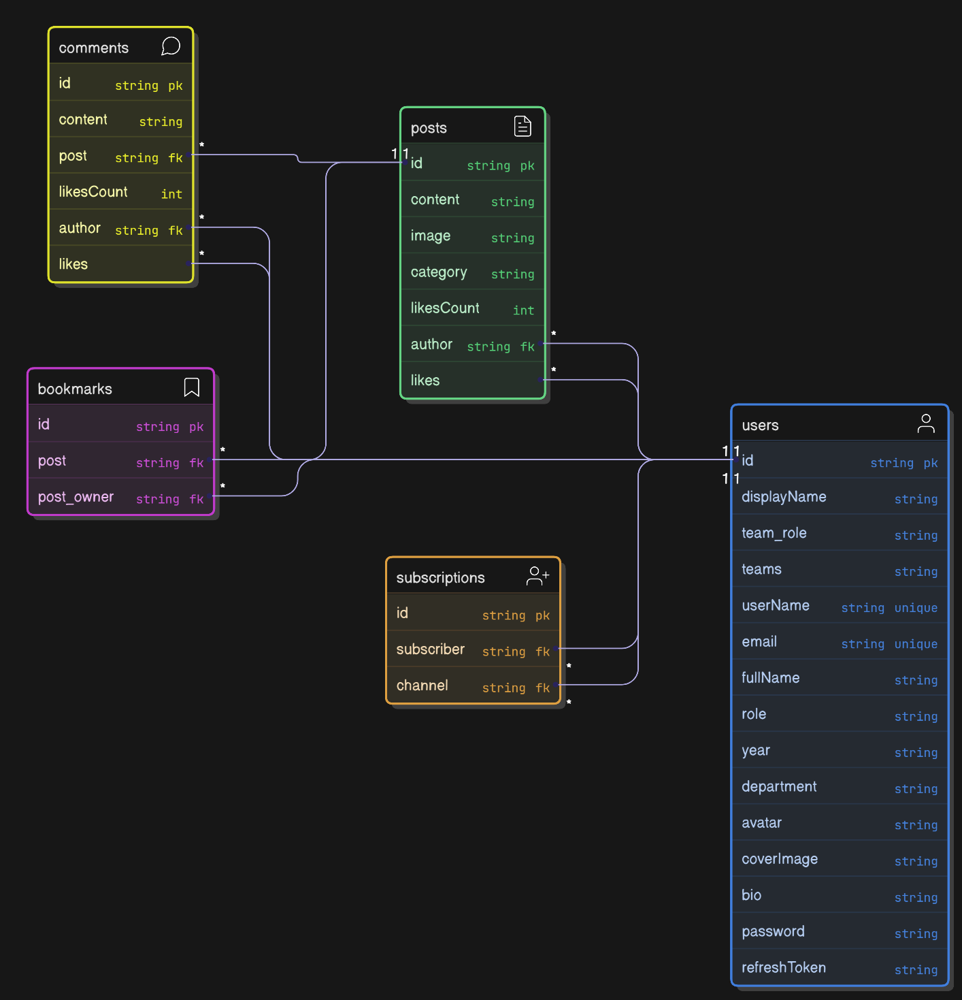

# \*_CampusX - Backend 🚀 _(Building in Progress)\*

**CampusX** is a dynamic and interactive platform designed exclusively for the **CMRIT community**. Whether you're a **student, faculty member, or part of a campus organization**, CampusX brings everyone together to **share updates, discuss topics, and stay informed** about everything happening on campus.

---

## **🚀 Tech Stack**

- **Node.js** - Runtime environment
- **Express.js** - Web framework
- **MongoDB + Mongoose** - Database & ORM
- **JWT Authentication** - Secure login system
- **Cloudinary** - Image storage
- **Multer** - File handling middleware
- **Redis** _(Upcoming)_ - Caching, rate limiting, and session management,improving performance
- **WebSockets (Socket.io)** _(Upcoming)_ - Real-time notifier for about the state of the request

# 🚀 **Optimizing CampusX Performance with Redis**(On Going)

CampusX leverages **Redis** to improve app performance by caching frequently accessed data and using queues for background tasks. WebSockets are used to notify the frontend in real time.

## **⚡ Caching with Redis for Faster API Responses**

Caching helps reduce the load on the database by storing frequently accessed data in memory. In CampusX, Redis caching is used for:

- **User Profiles:** When a user profile is requested, it is first checked in Redis. If found, it is returned instantly; otherwise, it is fetched from the database and stored in Redis for future requests.
- **Recent Posts & Comments:** Instead of querying the database every time, recent posts and comments are cached in Redis for quick retrieval, reducing query times.

This approach significantly improves API response times and enhances user experience.

---

## **⏳ Using Redis Queue for Heavy API Tasks**

Background tasks that require time to process are handled using a Redis queue to avoid blocking API responses. In CampusX, Redis queues are used for:

- **User Registration:** When a user signs up, their registration details are added to a queue, processed in the background, and then saved to the database.
- **Post Creation:** When a user creates a post, the request is immediately acknowledged, and the actual saving process is handled in the background.
- **OTP Sending:** OTPs are queued and processed asynchronously to avoid delays in the authentication process.

By using Redis queues, CampusX can handle a large number of requests efficiently without slowing down the user experience.

---

## 🚫 **Rate Limiting with Redis** to prevent spam in posts

## **📡 Real-Time Updates Using WebSockets**

WebSockets are used to send real-time updates to the frontend for various actions. In CampusX, WebSockets notify users about:

- **OTP Status:** Once an OTP is processed and sent, the frontend is updated in real time.
- **New Posts:** Users get instant notifications when a new post is created.
- **Other Notifications:** Important events like comments, likes, or mentions are delivered in real time using WebSockets.

This ensures users stay updated without needing to refresh the page.

---

## **🚀 Summary: Redis Optimization in CampusX**

| Feature                              | Benefit                                                |
| ------------------------------------ | ------------------------------------------------------ |
| **User Profile Caching**             | Reduces DB queries for profile fetch                   |
| **Post & Comment Caching**           | Speeds up retrieval of latest content                  |
| **User Queue**                       | Handles user registration efficiently                  |
| **Post Queue**                       | Offloads post creation to background workers           |
| **WebSockets for Real-Time Updates** | Instant feedback on OTPs, new posts, and notifications |

By combining **caching, queues, and WebSockets**, CampusX ensures high performance, scalability, and a seamless user experience. 🚀

## **🛠️ API Endpoints** _(Tested via Postman)_

### **Base URL:** `http://localhost:$port`

### 🔑 **OTP Authentication**

#### **POST /auth/send-otp** - Send OTP to user

| Key   | Type   | Description  |
| ----- | ------ | ------------ |
| email | String | User's email |

#### **POST /auth/verify-otp** - Verify OTP

| Key   | Type   | Description            |
| ----- | ------ | ---------------------- |
| email | String | User's email           |
| otp   | String | OTP received via email |

---

## **📝 User Routes**

### **POST /users/register** - Register a new user

| Key        | Type   | Description                                                       |
| ---------- | ------ | ----------------------------------------------------------------- |
| fullName   | String | Full name of the user                                             |
| email      | String | Email address                                                     |
| userName   | String | Username                                                          |
| password   | String | Password                                                          |
| role       | String | `Student`, `Faculty`, `Cell` (enum)                               |
| year       | String | `First-Year`, `Second-Year`, `PreFinal-Year`, `Final-Year` (enum) |
| department | String | `CSE`, `ISE`, `EEE`, `ECE`, `MBA`, `AIML`, `AIDS`, `CIVIL` (enum) |
| avatar     | File   | Profile picture                                                   |
| coverImage | File   | Cover image _(Optional)_                                          |

#### **POST /users/login** - Login

| Key      | Type   | Description      |
| -------- | ------ | ---------------- |
| email    | String | Registered email |
| password | String | User password    |

#### **GET /users/channel/:user** - Get a user's channel profile

#### **Secure Routes (JWT Required)** 🔒

- **POST /users/logout** - Logout
- **POST /users/refresh-token** - Refresh access token

- **POST /users/change-password** - Change password
  | Key | Type | Description |
  | -------- | ------ | ---------------- |
  | oldPassword | String | old password |
  | newPassword | String | new password |
  | confPassword | String | confirm new password |

- **GET /users/current-user** - Get logged-in user details
- **PATCH /users/update-account** - Update account details
  | Key | Type | Description |
  | -------- | ------ | ---------------- |
  | email | String | new email |
  | fullName | String | new full name |

- **PATCH /users/update-avatar** - Update profile picture
  | Key | Type | Description |
  | -------- | ------ | ---------------- |
  | avatar | File | Selected image |

- **PATCH /users/update-coverimage** - Update cover image
  | Key | Type | Description |
  | -------- | ------ | ---------------- |
  | coverImage | File | Selected image |

- **GET /users/get-bookmarks** - Get bookmarked posts
- **POST /users/:userId/follow** - Follow a user
- **POST /users/:userId/unfollow** - Unfollow a user
- **DELETE /users/delete-account** - Delete account

---

## **📝 Post Routes**

### **POST /posts/** - Create a post

| Key      | Type   | Description                                                                  |
| -------- | ------ | ---------------------------------------------------------------------------- |
| content  | String | Post content                                                                 |
| category | String | `general`, `exams`, `placements`, `competitions`, `hackathons`, `lost_found` |
| image    | File   | _(Optional)_ Image                                                           |

#### **Other Post Routes:**

- **GET /posts/** - Get all posts
- **GET /posts/:id** - Get a specific post
- **DELETE /posts/:id** - Delete a post

---

## **💬 Comments**

- **POST /posts/:postId/comments** - Add a comment
- **GET /posts/:postId/comments** - Get all comments
- **DELETE /posts/:postId/comments/:commentId** - Delete a comment

---

## **🔖 Bookmark Routes**

- **POST /bookmarks/:postId** - Bookmark a post
- **DELETE /bookmarks/:bookmarkId** - Remove bookmark
- **GET /bookmarks/** - Get all bookmarks

---

## **❤️ Like Routes**

- **POST /likes/:postId/like** - Like/unlike a post _(Toggle)_

---

### 🗄️ Database Models and Relationships

📌 Overview of Database Models in CampusX
CampusX has 5 main database models, each serving a specific function:

1️⃣ User Model – Stores user details, authentication data, and profile info.

2️⃣ Post Model – Manages posts made by users, including text, images, and categories.

3️⃣ Comment Model – Handles comments on posts with user references.

4️⃣ Subscription Model – Tracks which users follow which topics or other users.

5️⃣ Bookmark Model – Allows users to save posts for later reference.



## **⚙️ Installation & Setup**

### **1️⃣ Clone the Repository**

```sh
git clone git@github.com:prathvihan108/campusX.git
```

### **2️⃣ Install Dependencies**

```sh
npm install
```

### **3️⃣ Configure Environment Variables**

Create a `.env` file and add:

```env
# 📧 Email Configuration
EMAIL=your-email@smtp.com
EMAIL_PASSWORD=your-email-password
EMAIL_HOST=smtp-relay.yourhost.com
EMAIL_PORT=587

# 🌐 Server Configuration
PORT=5000

# 🗄️ Database Configuration
MONGO_URI=mongodb+srv://<username>:<password>@cluster.mongodb.net
DB_NAME=campusX

# 🔗 CORS Configuration
CORS_ORIGIN=http://localhost:3000 (front end url[use:"*" if testing using postman])

# 🔑 JWT Authentication
ACCESS_TOKEN_SECRET=your_access_token_secret
ACCESS_TOKEN_EXPIRY=15m
REFRESH_TOKEN_SECRET=your_refresh_token_secret
REFRESH_TOKEN_EXPIRY=7d

# ☁️ Cloudinary Configuration
CLOUDINARY_APIKEY=your_cloudinary_api_key
CLOUDINARY_SECRET=your_cloudinary_api_secret
CLOUDINARY_CLOUD_NAME=your_cloudinary_cloud_name
```

### **4️⃣ Start the Server**

```sh
npm run dev
```

## **Future Plans**

### 🔥 Trending & Personalized Recommendations

get ML-Based post recommendations tailored to your interests.

### 🤖 AI Chatbot Integration (Powered by Generative AI)

Quickly get answers to campus-related queries with AI-powered chat.

---

## **📌 Contributors**

- [**Prathviraj Hanimanale**](https://github.com/prathvihan108)

Contributions related to code optimization, potential bug fixes, and improvements are accepted. However, feature requests are not considered at this time.
If you're making a contribution, please create a pull request with a suitable branch name that reflects the changes being made. 🚀
